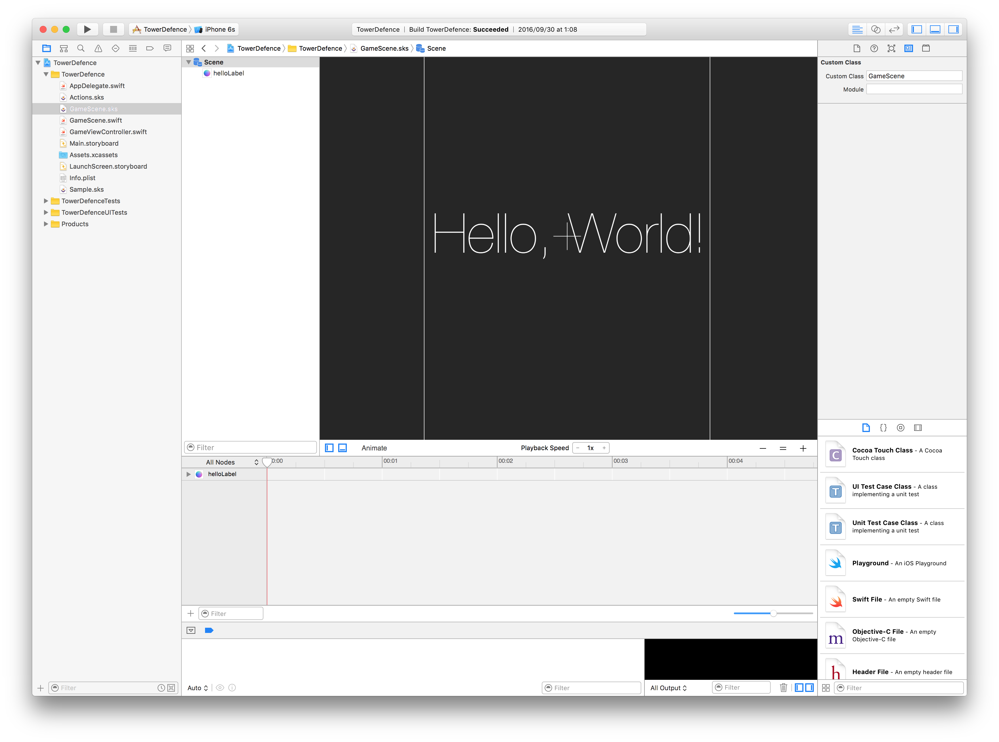
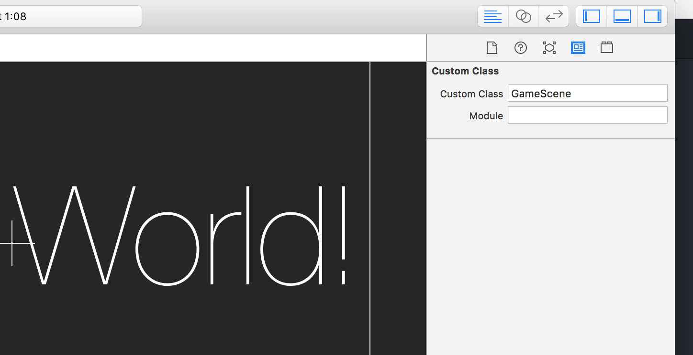

# 1日目 SKView,SKSceneの使い方
1日目でピックアップしたことを上から順にやるとは限らない。その日興味あるものをやる。
今日は、
技術 > プログラム > SKView,SKSceneの使い方
を勉強する。まずSpriteKitの雰囲気を感じようと思った。
 - 構成
 - sksファイル

## 構成
StoryboardにUIViewControllerがくっついていて、
UIViewControllerのViewをSKViewにして、
そのViewにSKSceneをくっつける。
SKSceneにキャラクター画像などのNodeをくっつけていく感じ。
```
UIViewController > SKView > SKScene > SKSpriteNode
```

## sksファイル
SKNodeのアクションや、SKSceneは .sksファイルでGUIからいじれるみたい。
New FIleで spriteKit Sceneを選んで追加する。


呼び出し方は
```Swift:GameViewController.swift
override func viewDidLoad() {
    super.viewDidLoad()

    if let view = self.view as! SKView? {
        // Load the SKScene from 'GameScene.sks'
        if let scene = SKScene(fileNamed: "GameScene") {
            // Set the scale mode to scale to fit the window
            scene.scaleMode = .aspectFill

            // Present the scene
            view.presentScene(scene)
        }

        view.ignoresSiblingOrder = true

        view.showsFPS = true
        view.showsNodeCount = true
    }
}
```
SKScene(fileNamed: "GameScene")でSKViewからGameScene.sksをを呼び出して
GameScene.sksのCustomClassに　GameScene.swiftなどのSKSceneを継承しているクラスをしてしてやると使えるぽい。コメントアウトにある通り。   



SpriteKit SceneのGUIで貼り付けたLabelなどは
```
self.label = self.childNode(withName: "//helloLabel") as? SKLabelNode
```
こんな感じでよびだせる。

アクションも基本は同じで
new file で SpriteKit Actionを選択して追加

左下の十字ボタンをクリックしてアクション名を入力して追加。
基本的なコンポーネントがあるので、ドラッグアンドドロップで追加する。任意のパラメータを設定すれば使う準備はOK


呼び出しは
```
label.run(SKAction.init(named: "Pulse")!, withKey: "fadeInOut")
```
これでいける。

 - [今日のcode1](st00_00/)
 - [今日のcode2](st00_01/)
