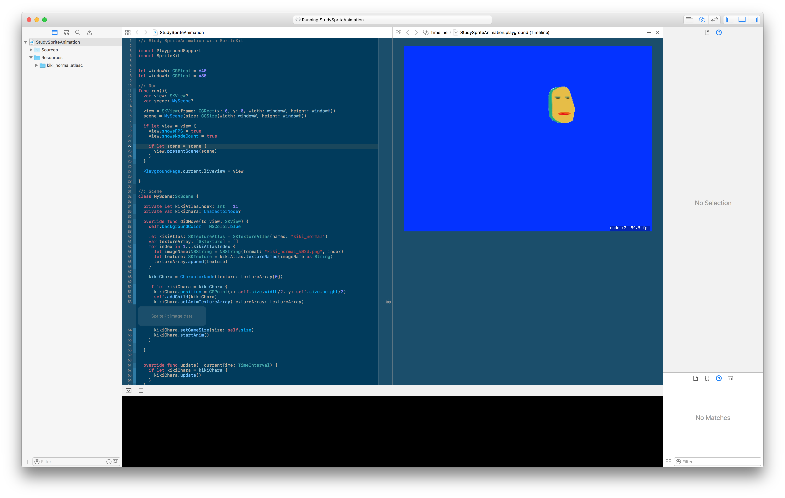
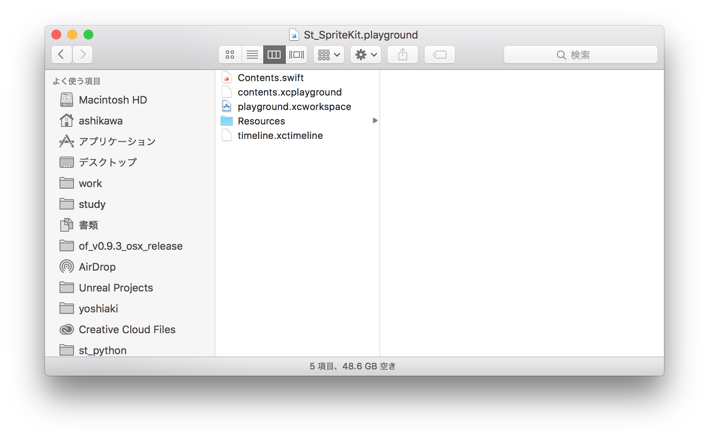
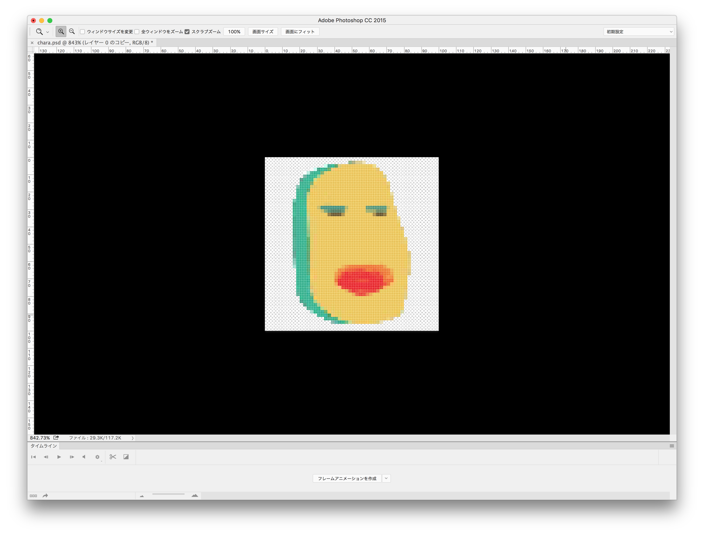

# 2日目 Playgroundでスプライトアニメーション
SpriteKitのちょっとした機能を学ぶ時にいちいちXcodeのプロジェクトを作るのはしんどい。   
ということで、ちょっとした機能の確認はPlaygroundでやっていこう。うむ。

 - とりあえずPlaygroundでSKSceneを表示させる
 - スプライトアニメーション

## とりあえずPlaygroundでSKSceneを表示させる
まずコード載せとく。以下のコードでswift3.0の場合見れる。SKSceneがレンダリングされる。

```Swift
//: Playground - noun: a place where people can play

import PlaygroundSupport
import SpriteKit
import UIKit


let w: CGFloat = 640
let h: CGFloat = 480

let rect: CGRect = CGRect(x: 0, y: 0, width: w, height: h)
let view: SKView = SKView(frame: rect)
view.showsFPS = true
view.showsNodeCount = true


let scene: SKScene = SKScene(size: CGSize(width: w, height: h))
scene.scaleMode = SKSceneScaleMode.aspectFill
scene.backgroundColor = UIColor.blue


view.presentScene(scene)


PlaygroundPage.current.liveView = view
```

### 注意する点
未熟者にとっては色々とひっかけがある。

 - Asistant Editorを表示させておく
 - Swift3.0ではXCPlaygroundはつかえない。
 - PlaygroundSupportを最初にインポートしとけ。

#### Asistant Editorを表示させておく
これ当たり前だけど、  
View > Asistant Editor > Show Asistant Editor でAsistant Editorを表示させておく


#### Swift3.0ではXCPlaygroundはつかえない。
swift3.0ではXCPlaygroundは使えない。
検索順位の高いswift1.0や2.0時代の記事にはきをつけろ。viewの表示にはPlaygroundSupportを使え！

viewの表示はこれ

```
PlaygroundPage.current.liveView = view
```

#### PlaygroundSupportを最初にインポートしとけ。
そしてなぜかimport順で表示できなかったりしたからとりあえずPlaygroundSupportを1番最初にインポートしとけ。

```
import PlaygroundSupport
import UIKit
import SpriteKit
```
な感じ。

[sample code](./st02/St_SpriteKit.playground)

## スプライトアニメーション
viewが表示できちゃえばこっちのもん。    
簡単にスプライトアニメーションできました。楽チン    



[sample code](./st03/StudySpriteAnimation.playground)

 - PlayGroundでのリソース
 - ドット絵の作成方法

### PlayGroundでのリソース
.playgroundファイルは.appファイルみたいになっていて右クリックしてパッケージ内容を表示すると中が観れる。   
Resoucesディレクトリの中に画像とかを追加していくと使えるようになる。   
ま、普通はサイドバーにResoucesがあるのでそっからついかすればok    



### ドット絵の作成方法
フォトショで比較的簡単にドット絵を作成する方法があった。    
[ドット絵描く楽な方法見つけた！気がする](http://design.kayac.com/topics/2012/02/post-47.php)

 1. イラストつくる（実は今回は友達のイラストを拝借）
 2. photoshopでドット絵に
 3. レイヤーごとpngで吐き出す。
 4. texturePackerでtextureAtlasに。
 5. spriteKitで使う。

という感じで使った。  
しっかりとしたモーションをつけたい場合は
2のあとに動画編集ソフトに持っていって動画を作成。ffmpegで動画から連番生成 > ４に。   
って感じになるのかな。



### References
objective-cで書かれているやつも、やり方はとても参考になる。swiftで書き直してやればよいだけだ。

 - [Sprite Kit Animations and Texture Atlases in Swift](https://www.raywenderlich.com/89222/sprite-kit-animations-texture-atlases-swift)
 - [[iOS 7] Sprite Kit の Texture Atlas を使ってみた](http://dev.classmethod.jp/references/ios7-spritekit-texture-atlas/)
 - [ドット絵描く楽な方法見つけた！気がする](http://design.kayac.com/topics/2012/02/post-47.php)
