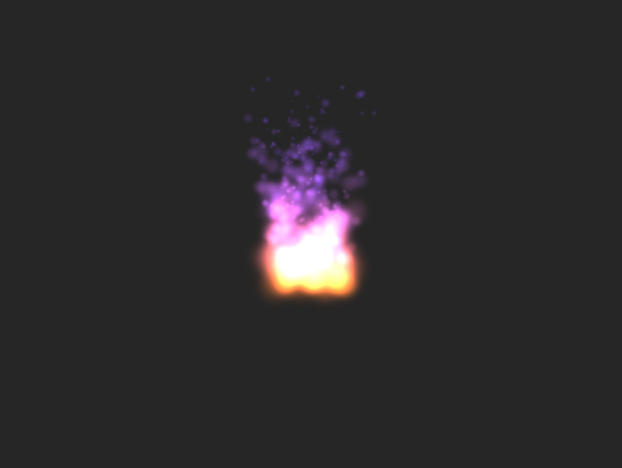

# SpriteKit Particle



## Create particle from sks file

```
let path = Bundle.main.path(forResource: "MyParticle", ofType: "sks")
let fire = NSKeyedUnarchiver.unarchiveObject(withFile: path!) as! SKEmitterNode

if let scene = scene {
  let position = CGPoint(x: w/2, y: h/2)
  fire.position = position
  scene.addChild(fire)
}
```
なんだかんだで、appleのdocument見るのが一番良い。

## References
 - [SKEmitterNode](https://developer.apple.com/reference/spritekit/skemitternode)
