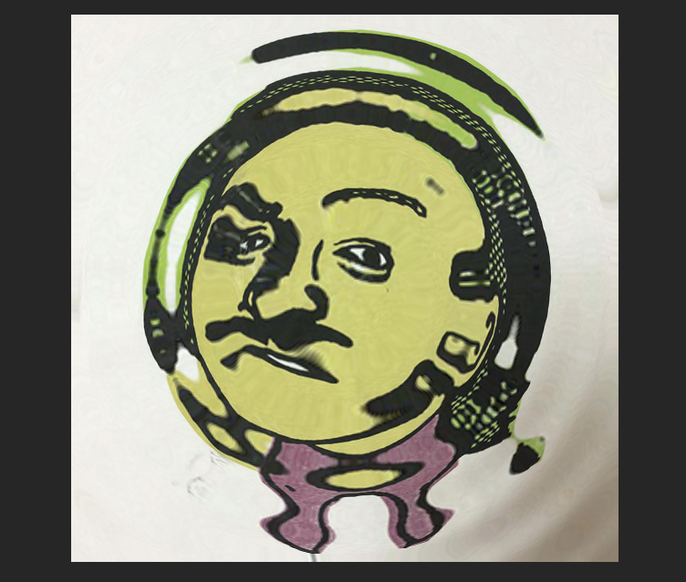

# SKShader
さてつぎはshaderの使い方や！
くそ楽だった!



```Swift
//: Playground - noun: a place where people can play

import PlaygroundSupport
import UIKit
import SpriteKit

var view: SKView?
var scene: SKScene?
let w: CGFloat = 640
let h: CGFloat = 480


func setup(){
  view = SKView.init(frame: CGRect(x: 0, y: 0, width: w, height: h))
  if let view = view {
    scene = SKScene(size: view.frame.size)
    view.presentScene(scene)
    PlaygroundSupport.PlaygroundPage.current.liveView = view
  }
}


func createObject(){

  let shaderNodeTexture = SKTexture(imageNamed: "profile")
  let shaderNode = SKSpriteNode(texture: shaderNodeTexture)

  shaderNode.size = CGSize(width: 300, height: 300)
  shaderNode.position = CGPoint(x: w/2, y: h/2)
  let shader = SKShader(fileNamed: "sample.fsh")
  shaderNode.shader = shader

  if let scene = scene {
    scene.addChild(shaderNode)
  }


}


setup()
createObject()

```

SKSpriteNodeのプロパティにプショナルのshaderがあるんで
SKShaderでインスタンスつくってぶちこんでやればできあがり、
uniformも渡せる。
```Swift
shader.uniforms = [    
    SKUniform(name: "u_sprite_size", vectorFloat2: spriteSize)
  ]
```
くそ楽やんけ。。最初っから宣言されてて利用できるuniformの一覧は以下
[SKShader: Creating a Custom Fragment Shader](https://developer.apple.com/reference/spritekit/skshader#1654217)

今回の波紋のサンプルはフルパクリです。ありがとうございます。


## References
 - [SKShader](https://developer.apple.com/reference/spritekit/skshader)
 - [SpriteKitのSKShaderを試してみた【iOS8〜】](http://www.dorapro.co.jp/engineerblog/?p=533)
