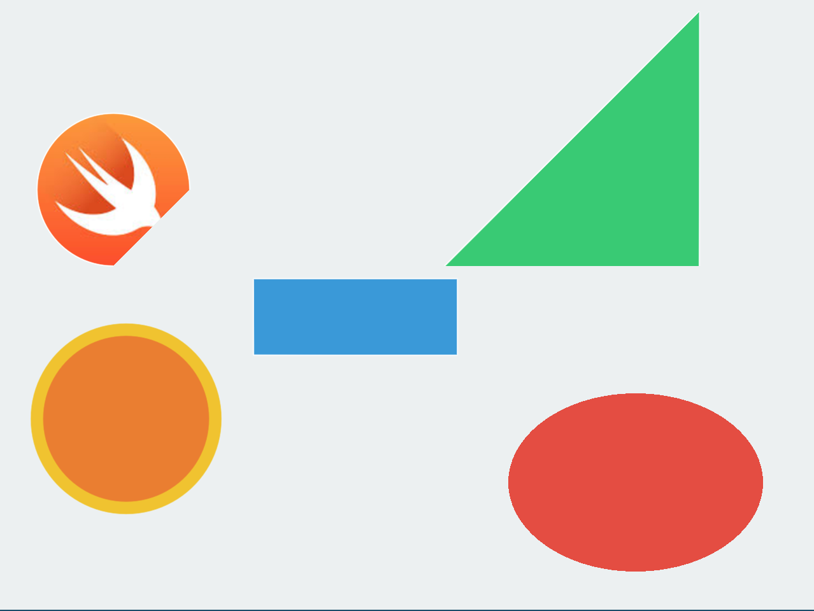

# 5日目 図形描くのどうすんだ。 - SKShapeNode



描画クラスがあるのでそれでちょいちょいとプロパティ指定するだけ。    
プロパティの指定方法はこれといって特別なことはなく他のcanavs系と同じ。  
pathを指定すればカスタムシェイプが作れる。 CGMutablePathはいろいろmethod持ってるので必要になったら適宜見る。    
shapeにtexture貼ったりしたけど、spriteの機能でアニメーションするより、shaderでアニメーションさせた方が早いよな。。

- 円形
- 楕円形
- 四角形
- 三角形（カスタムシェイプ）
- 弧（カスタムシェイプ）

---

## 円形
```swift
// 円を描く
let ball: SKShapeNode = SKShapeNode(circleOfRadius: 70)
//色を決める
ball.fillColor = UIColor.init(red: 236/255, green: 126/255, blue: 34/255, alpha: 1)
//線の色
ball.strokeColor = UIColor.init(red: 241/255, green: 196/255, blue: 15/255, alpha: 1)
//線の太さ
ball.lineWidth = 10
ball.position = CGPoint(x: 100, y: 150)
// ball.position = CGPoint(x: CGFloat(UInt32(arc4random()%UInt32(w))), y: CGFloat(UInt32(arc4random()%UInt32(h))))

```
## 楕円形

```
let ellipse = SKShapeNode.init(ellipseOf: CGSize(width: 200, height: 140))
ellipse.fillColor = UIColor.init(red: 231/255, green: 76/255, blue: 60/255, alpha: 1)
ellipse.lineWidth = 0
ellipse.position = CGPoint(x: 500, y: 100)
self.addChild(ellipse)
```

## 四角形
```swift
let rect: SKShapeNode = SKShapeNode.init(rect: CGRect(x: 0, y: 0, width: 160, height: 60))
rect.fillColor = UIColor.init(red: 52/255, green: 152/255, blue: 219/255, alpha: 1.0)
rect.position = CGPoint(x: 200, y: 200)

```

## 三角形（カスタムシェイプ）
```
let path = CGMutablePath()
path.move(to: CGPoint(x: 0.0, y: 0.0))
path.addLine(to: CGPoint(x: 200.0, y: 200.0))
path.addLine(to: CGPoint(x: 200.0, y: 0.0))
let pathNode = SKShapeNode(path: path)
pathNode.fillColor = UIColor.init(red: 46/255, green: 204/255, blue: 113/255, alpha: 1.0)
pathNode.position = CGPoint(x: 350, y: 270)
```

## 弧（カスタムシェイプ）
```
let path2 = CGMutablePath()
path2.addArc(center: CGPoint(x: 30,y: 30), radius: 60, startAngle: CGFloat(M_PI/180*0), endAngle: CGFloat(M_PI/180*270), clockwise: false)
let pathNode2 = SKShapeNode(path: path2)
// テクスチャー指定
pathNode2.fillTexture = SKTexture(imageNamed: "material.png")
pathNode2.fillColor = UIColor.init(red: 1.0, green: 1.0, blue: 1.0, alpha: 1.0)
pathNode2.position = CGPoint(x: 60, y: 300)
```


## references
 - [SKShapeNode](https://developer.apple.com/reference/spritekit/skshapenode)
 - [CGMutablePath](https://developer.apple.com/reference/coregraphics/cgmutablepath)
