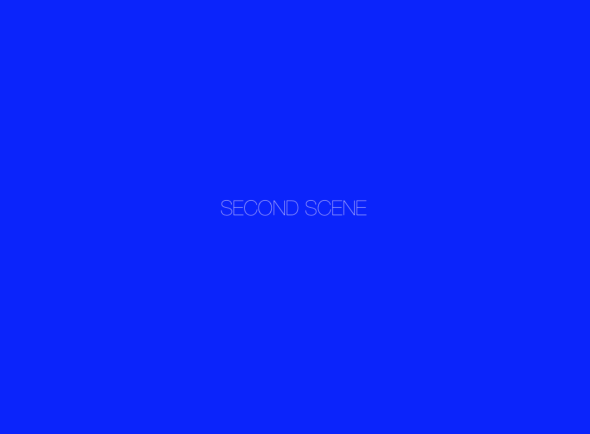

# 7日目 GKStateMachineでシーン管理]



<br>
画面をタッチするとシーンが入れ替わるだけ。GKStatemachineでシーン管理をしてみた。
SKSceneを持ったstateを作ってenterするときに切り替わるようにしている。   
もうちょっとうまい書き方がある気がするが。。    
以下に全文(実際にはもちろんファイル分けて利用する。)


```
//: Playground - noun: a place where people can play

import UIKit
import PlaygroundSupport
import SpriteKit
import GameplayKit

let w = 640
let h = 480

class GameView: SKView {

  var sceneManager: GKStateMachine?

  override init(frame: CGRect) {
    super.init(frame: frame)

    sceneManager = GKStateMachine(states: [
      TopSceneState(view: self),
      SecondSceneState(view: self)
    ])

  }

  required init?(coder aDecoder: NSCoder) {
    fatalError("init(coder:) has not been implemented")
  }

  override func didMoveToWindow() {
		sceneManager?.enter(TopSceneState.self)
  }
}

////////////////////////////////
// BaseState
class MySceneState: GKState {
  let view: SKView

  init(view: SKView){
    self.view = view
  }
}

// TopState
class TopSceneState: MySceneState {
  var scene: TopScene?

  override func didEnter(from previousState: GKState?) {
    if let stateMachine = stateMachine {
      self.scene = TopScene(size: CGSize(width: w, height: h), stateMachine: stateMachine)
      self.view.presentScene(self.scene)
    }
  }

  override func willExit(to nextState: GKState) {
    self.scene?.removeFromParent()
  }
}

// SecondState
class SecondSceneState: MySceneState {
  var scene: SecondScene?

  override func didEnter(from previousState: GKState?) {
    if let stateMachine = stateMachine {
      self.scene = SecondScene(size: CGSize(width: w, height: h), stateMachine: stateMachine)
      self.view.presentScene(self.scene)
    }
  }
  override func willExit(to nextState: GKState) {
    self.scene?.removeFromParent()
  }
}

////////////////////////////////
// StateScene
class StateScene: SKScene {
  var stateMachine: GKStateMachine?
  init(size: CGSize, stateMachine: GKStateMachine) {
    super.init(size: size)
    self.stateMachine = stateMachine
  }

  required init?(coder aDecoder: NSCoder) {
    fatalError("init(coder:) has not been implemented")
  }
}

// TopScene
class TopScene: StateScene {

  override func didMove(to view: SKView) {
    let label = SKLabelNode(text: "TOP SCENE")
    label.fontSize = 22
    label.position = CGPoint(x: self.size.width/2, y: self.size.height/2)
    self.addChild(label)
  }

  override func touchesBegan(_ touches: Set<UITouch>, with event: UIEvent?) {
    stateMachine?.enter(SecondSceneState.self)
  }
}

// SecondScene
class SecondScene: StateScene {

  override func didMove(to view: SKView) {
    self.backgroundColor = UIColor.blue
    let label = SKLabelNode(text: "SECOND SCENE")
    label.fontSize = 22
    label.position = CGPoint(x: self.size.width/2, y: self.size.height/2)
    self.addChild(label)
  }

  override func touchesBegan(_ touches: Set<UITouch>, with event: UIEvent?) {
    stateMachine?.enter(TopSceneState.self)
  }
}


let gameView = GameView(frame: CGRect(x: 0, y: 0, width: w, height: h))

PlaygroundPage.current.liveView = gameView

```

## References
 - [Apple developer API Reference - SKPhysicsBody](https://developer.apple.com/reference/spritekit/skphysicsbody)
 - [Swift + Playgraoundメモ 2 – SpriteKitで物理シミュレーション](http://yoppa.org/blog/5477.html)
 - [Sprite Kitでブロック崩し](http://tnantoka.github.io/hello-spritekit/ja/)
 - [Sprite Kit 入門 - SKPhysicsBody](http://spritekit.senchan-office.com/index.php/skphysicsbody)
